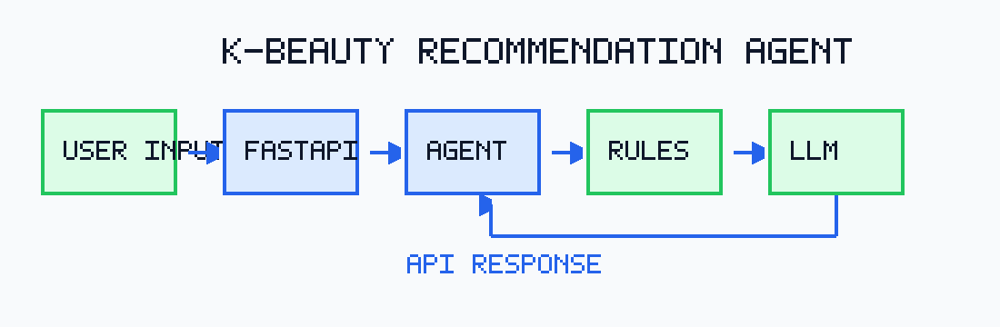

# K-Beauty Recommendation Agent

## Overview

K-Beauty Recommendation Agent is a FastAPI-based AI service that recommends Korean beauty products based on user skin type, concerns, preferences, and language input.

This repository is structured as a portfolio project: the backend is intentionally compact, readable, and easy to run locally while still showing a practical rule-first AI product workflow.

## Key Features

- Personalized K-beauty product recommendation
- Rule-based recommendation logic
- LLM-powered response generation
- Korean/English bilingual support
- FastAPI backend
- Render deployment ready

## Tech Stack

- Python
- FastAPI
- OpenAI API
- Render
- GitHub

## Architecture

```text
User Input -> FastAPI Server -> Agent Workflow -> Recommendation Rules -> LLM Response -> API Response
```



## Project Structure

```text
k-beauty-agent/
|-- README.md
|-- requirements.txt
|-- .gitignore
|-- .env.example
|-- LICENSE
|-- app/
|   |-- main.py
|   |-- config.py
|   |-- schemas.py
|   `-- api/
|       `-- routes.py
|-- agent/
|   |-- workflow.py
|   |-- prompt_templates.py
|   `-- recommendation_rules.py
|-- data/
|   `-- sample_products.json
|-- docs/
|   |-- architecture.png
|   |-- demo.md
|   `-- api_spec.md
`-- tests/
    `-- test_recommendation.py
```

- `app/`: FastAPI application, API routes, configuration, and request/response schemas.
- `agent/`: Recommendation workflow, prompt templates, and rule-based scoring logic.
- `data/`: Small public sample product dataset for local execution and tests.
- `docs/`: Architecture, demo scenarios, and API documentation.
- `tests/`: Automated tests for the recommendation workflow and API behavior.

## How to Run

```bash
git clone https://github.com/yeonwo00/K-beauty-agent_oliveyoung.git
cd K-beauty-agent_oliveyoung
python -m venv .venv
source .venv/bin/activate
pip install -r requirements.txt
uvicorn app.main:app --reload
```

Open the API docs:

```text
http://127.0.0.1:8000/docs
```

## Example Request

```bash
curl -X POST http://127.0.0.1:8000/api/recommend \
  -H "Content-Type: application/json" \
  -d '{
    "skin_type": "oily",
    "concerns": ["oil_control", "pores"],
    "preferences": ["lightweight", "fragrance-free"],
    "language": "en",
    "limit": 3
  }'
```

## Environment Variables

Copy `.env.example` to `.env` if you want to enable LLM-assisted explanations.

```bash
cp .env.example .env
```

The service works without an OpenAI API key. When `OPENAI_API_KEY` is missing, it returns grounded rule-based explanations.

## Tests

```bash
python -m pytest -q
```

## Notes

This project is a recommendation-system demo, not medical advice. Product matches are based on a small sample dataset and simplified skin-care rules for portfolio demonstration purposes.
